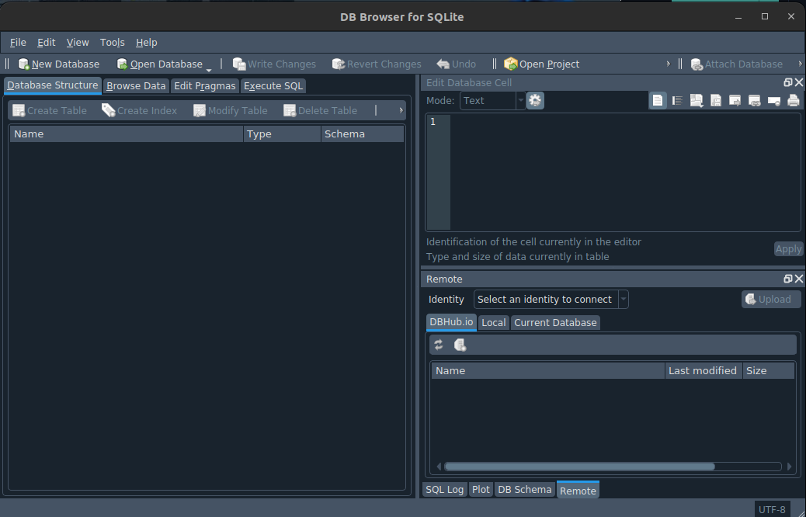
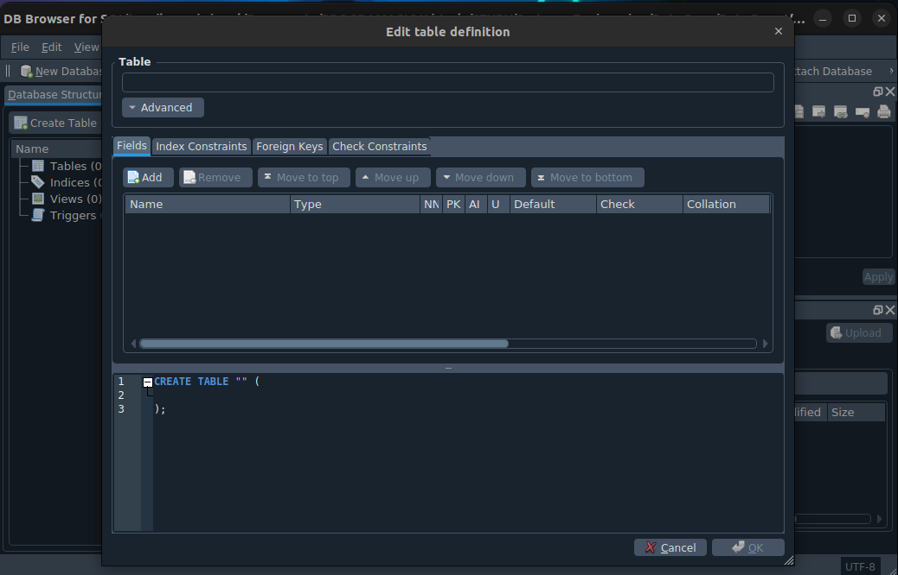

# Modelo Entidad-Relación (Notación Chen)

Este documento resume los conceptos fundamentales del Modelo Entidad-Relación (ER) utilizando la **Notación de Chen**, esencial para el diseño de bases de datos.

## 1. Entidad
Una entidad es la **representación** de un objeto o concepto del mundo real distinguible de otros. No es el objeto físico en sí, sino su abstracción para almacenar información en la base de datos.

* **Ejemplos:** Personas, Compras, Automóviles, Cursos.
* **Representación:** Se utiliza un **rectángulo** con el nombre de la entidad en su interior.

## 2. Atributos
Son las características o propiedades que describen a una entidad. Es la información específica que nos interesa guardar.

* **Ejemplo:** Una casa tiene atributos como *color*, *tamaño*, *dirección*.
* **Representación:** Se utilizan **elipses (óvalos)** unidos a la entidad por una línea.

### Tipos de Atributos

Existen diferentes categorías de atributos según su naturaleza:

#### A. Atributos Simples
Son aquellos que tienen un valor único y atómico (indivisible).
* **Ejemplo:** El *precio* de un producto.
* **Representación:** Un óvalo normal.

#### B. Atributos Compuestos
Son atributos que pueden dividirse en sub-partes más pequeñas con significado propio. No crean una nueva entidad, sino que estructuran mejor la información.
* **Ejemplo:** Una *Dirección* se compone de *Calle*, *Ciudad* y *Código Postal*.
* **Representación:** Del óvalo principal salen "ramas" hacia otros óvalos más pequeños.

#### C. Atributos Multivalor
Se utilizan cuando un atributo puede tener múltiples valores para una misma entidad.
* **Ejemplo:** *Hobbies* (una persona puede tener varios) o *Teléfonos* (casa, móvil, trabajo).
* **Representación:** Se utiliza un **doble óvalo** (doble línea).

#### D. Atributos Derivados
Son valores que no se almacenan directamente, sino que se calculan o deducen a partir de otros atributos existentes.
* **Ejemplo:** La *Edad* se deriva de la *Fecha de Nacimiento*.
* **Representación:** Se utiliza un óvalo con **línea punteada**.

## 3. Claves (Keys)
La Clave (o Llave Primaria) es el atributo fundamental que permite **identificar de manera única** a cada instancia de una entidad. No pueden existir dos entidades con la misma clave.

* **Ejemplo:** Un *DNI*, *Número de Seguridad Social* o *ID de estudiante*.
* **Representación:** Es un atributo cuyo texto interior aparece **subrayado**.

# Empecemos Con El Codigo!
Antes de comenzar es preciso saber que necesitamos un gestor de base de Datos.

Una base de datos es un conjunto de informacion organizada y estructurada que ponemos orgranizar y manipular de forma eficiente.

Para este caso, usaremos SQLite, es el gestor de base de datos mas COMUN del mundo.
No necesita servidor, podemos usarlo sin configurar cosas extras!
Su consola es muy simple.

Abriremos la aplicacion, y lo primero que vemos es esto:


Empecemos con los comandos

## Crear base de datos.
Para crear una base de datos usaremos el comando:

```
CREATE DATABASE "usuarios"
```

pero aun no sabemos donde colocar este comando, asi que crearemos una base de datos manualmente.

Cuando la creemos nos saldra algo como:


Tenemos que crear una Tabla, una tabla es una estructura de datos que tiene filas y columnas

Las tablas en una base de datos tienen nombres.


Las columnas las llamamos campos ( las verticales bro ), lo que contiene esa columna es el valor del campo " la celda "
Un registro es una fila, vale?

---
*Resumen de estudio sobre Bases de Datos.*